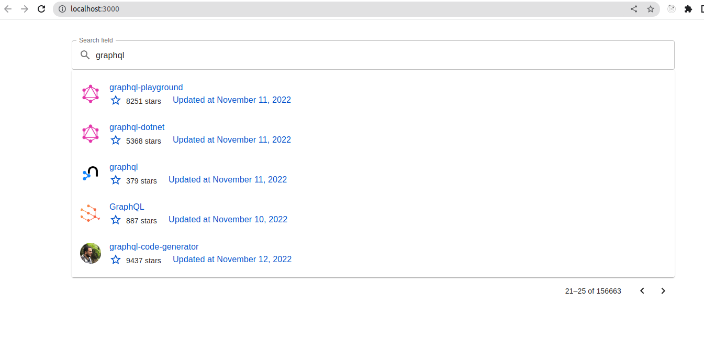

# Github Repository Browser


## SET UP

1. Install dependencies

```npm install```  or  ```yarn```

2. Set env variables

Create .env file and set REACT_APP_GITHUB_TOKEN with the generated token.

```REACT_APP_GITHUB_TOKEN=```

3. Start

```npm start```   or ```yarn start```


## Screenshot


